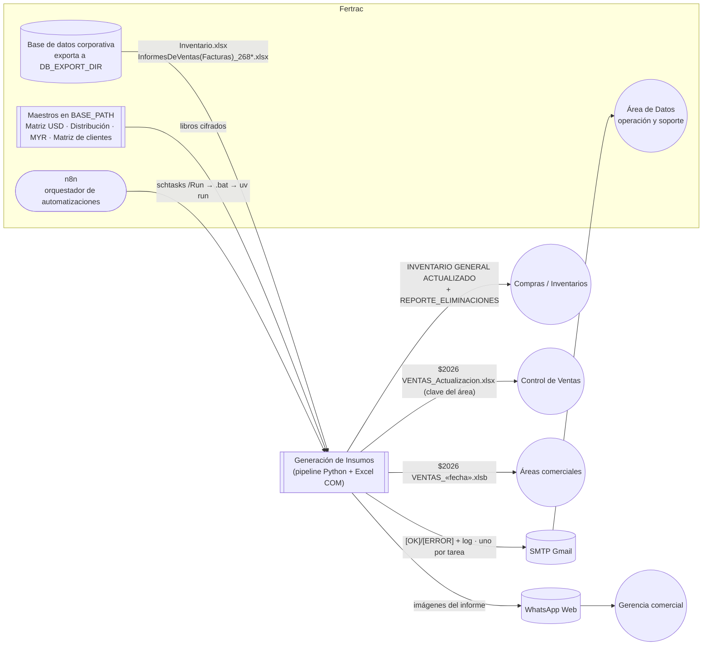
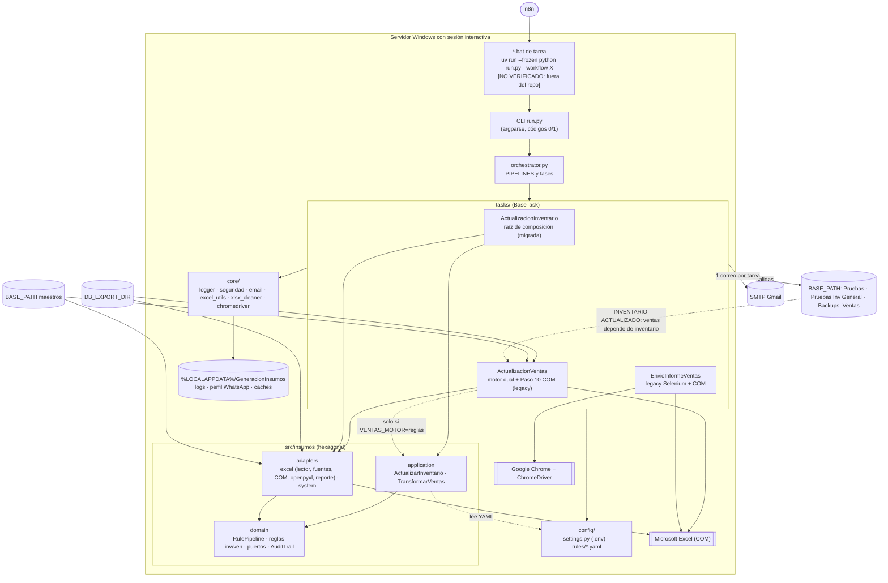

# 01 · Contexto C4 (niveles 1 y 2)

> Fuente: `graphify-out/graph.json` (comunidades «Orquestador y CLI», «Composición de inventario», «Ejecución y post-proceso de ventas», «WhatsApp Web (Selenium)»; hiperaristas `he_composicion_inventario`, `he_paso10_postproceso`, `he_motor_dual_paridad`) y nodos semánticos `docs_documentacion_generacion_de_insumos_orquestacion_n8n`, `readme_sesion_interactiva`.
> Los `.bat` de producción y la configuración de n8n **no están en el repositorio**: su existencia se toma del docx (Parte 1 §3.3) y se marca **[NO VERIFICADO]** en el código.

## 1. Nivel 1 — Contexto del sistema

> **Diagrama interactivo** (Archify, verificado contra `088f6f0`): [abrir en el índice](diagramas/main.html#01_contexto) · [abrir aparte](diagramas/01_c4-contexto.html). El bloque Mermaid de abajo es la versión resumida para leer en GitHub/VS Code.

| Actor / sistema | Relación | Evidencia |
|---|---|---|
| Base de datos (exportación) | Entrada única de inventario y ventas | ADR 0008 (archivo eliminado en `86f7093`); `config/settings.py:L83` · `config_settings_pathsconfig`; `env_db_export_dir` |
| Maestros en `BASE_PATH` | Enriquecimiento (Matriz USD, Distribución, MYR, Matriz de clientes) | `src/insumos/adapters/excel/maestros.py:L35` · `src_insumos_adapters_excel_maestros_leer_matriz_usd`; `src/insumos/adapters/excel/fuentes_ventas.py:L86` · `src_insumos_adapters_excel_fuentes_ventas_leer_myr` |
| n8n + Programador de tareas | Disparo diario; lee `resultado_<tarea>.txt` | `docs_documentacion_generacion_de_insumos_orquestacion_n8n` **[NO VERIFICADO en código: .bat fuera del repo]** |
| SMTP | Un correo por ejecución de tarea; ninguno en `--dry-run` de inventario (`tasks_base_task_notificacion_por_tarea`) | `core/email_notifier.py:L16` · `core_email_notifier_emailnotifier` |
| WhatsApp Web | Envío del informe | `tasks/envio_informe_ventas.py:L360` · `tasks_envio_informe_ventas_whatsappweb` |

## 2. Nivel 2 — Contenedores

> **Diagrama interactivo** (Archify, verificado contra `088f6f0`): [abrir en el índice](diagramas/main.html#02_contenedores) · [abrir aparte](diagramas/01_c4-contenedores.html). El bloque Mermaid de abajo es la versión resumida para leer en GitHub/VS Code.

| Contenedor | Responsabilidad | Comunidad del grafo | Evidencia |
|---|---|---|---|
| CLI `run.py` | Parseo de argumentos, `--dry-run` vía `INSUMOS_DRY_RUN`, código de salida | Orquestador y CLI | `run.py:L1` · `run`; `env_insumos_dry_run` |
| Orquestador | Workflows `completo`, `ventas`, `inventario`, `parcialVentas`, `envio`; un fallo no detiene las fases siguientes | Orquestador y CLI | `orchestrator.py:L66` · `orchestrator_orchestrator` |
| Tarea inventario | Raíz de composición: fuente → caso de uso → escritor COM/openpyxl → reporte | Composición de inventario | `tasks/actualizacion_inventario.py:L63` · `tasks_actualizacion_inventario_actualizacioninventario_construir` |
| Tarea ventas | Localiza insumos, respaldo, selector de motor, Paso 10 COM, post-proceso | Ejecución y post-proceso de ventas · Paso 10 COM de ventas | `tasks/actualizacion_ventas.py:L2553` · `tasks_actualizacion_ventas_actualizacionventas_ejecutar` |
| Tarea envío | Capturas Excel → portapapeles → WhatsApp Web | WhatsApp Web (Selenium) · Capturas del informe | `tasks/envio_informe_ventas.py:L1626` · `tasks_envio_informe_ventas_envioinformeventas_execute` |
| Núcleo `src/insumos` | Dominio puro + casos de uso + adaptadores | Puertos del dominio · RulePipeline declarativo · Registro de reglas · Caso de uso inventario y pipeline | `src_insumos_domain_ports`, `src_insumos_domain_pipeline_rulepipeline` |
| `core/` | Infraestructura compartida del legacy | Logger y correo · Seguridad, secretos y docx · Reducción de tamaño xlsx · Gestión de chromedriver | `core_logger_get_logger`, `core_seguridad_filtrosecretos`, `core_xlsx_cleaner_reducir_tamano_xlsx` |
| `config/` | `.env` → dataclasses inmutables; YAML de reglas | Settings y exportación BD · Reglas YAML de inventario · Reglas YAML de ventas | `config/settings.py:L137` · `config_settings_settings` |
| Excel COM | Escritura con fidelidad de formato, tablas dinámicas, cifrado, capturas | externo | imports `win32com` en 4 archivos del código (el grafo registra 3: `com_inventario` lo importa dentro de una función) |
| Chrome/ChromeDriver | Sesión WhatsApp persistente; driver compatible | externo | `core/chromedriver_utils.py:L259` · `core_chromedriver_utils_obtener_chromedriver_path` |
| Estado operativo | Logs y perfiles fuera del repo | Estado operativo (STATE_DIR) | `core/logger.py:L14` · `core_logger_logs_root`; ADR 0006 (archivo eliminado en `86f7093`) |

## 3. Restricciones de despliegue que condicionan la arquitectura

- **Sesión interactiva obligatoria**: Excel COM y el portapapeles no funcionan en Session 0 ni con escritorio remoto desconectado (`readme_sesion_interactiva`; `tasks_envio_informe_ventas_diagnosticar_portapapeles`).
- **Windows + Excel de escritorio + Chrome**: dependencias de `pywin32`, `selenium`, `webdriver-manager` declaradas con marcador `sys_platform == 'win32'` donde aplica (`pyproject.toml`).
- **Hora de negocio America/Bogota** independiente del servidor (`src_insumos_adapters_system_reloj_hora_colombia`; `src/insumos/adapters/system/reloj.py:L22` · `src_insumos_adapters_system_reloj_hoy`).
- **Orden**: inventario antes que ventas (`tasks_actualizacion_ventas_dependencia_inventario`; `tasks/actualizacion_ventas.py:L500` · `tasks_actualizacion_ventas_actualizacionventas_find_inventario_actualizado`).
