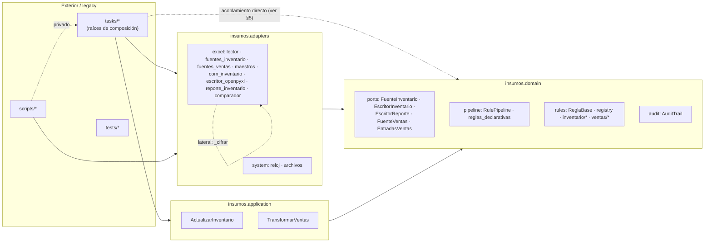

# 02 · Arquitectura hexagonal

> Fuente: comunidades 1 (Reglas de negocio puras), 5 (Motor de reglas y auditoría), 6 (Motor dual de ventas), 7 (Caso de uso inventario BD), 8 (Contrato YAML y registro), 11 (Regla de dependencia hexagonal) y GRAPH_REPORT §6.

## 1. Capas y regla de dependencia

| Capa | Ubicación | Puede importar | Prohibido | Verificación |
|---|---|---|---|---|
| Dominio | `src/insumos/domain` | pandas, PyYAML, unidecode, stdlib | `win32com`, `selenium`, `openpyxl`, `msoffcrypto`, `xlsxwriter`, `insumos.application`, `insumos.adapters`, legacy | `.importlinter` contratos 1, 2, 3 y 5 (`importlinter_contract_1`, `importlinter_contract_2`, `importlinter_contract_3`, `importlinter_contract_5`); `tests/contract/test_regla_dependencia.py` · `tests_contract_test_regla_dependencia` |
| Aplicación | `src/insumos/application` | Dominio | Infraestructura y legacy | contratos 1, 4 y 5 (`importlinter_contract_4`) |
| Adaptadores | `src/insumos/adapters` | Aplicación, dominio, librerías de infraestructura | Legacy por convención (README) | contrato 1 (capas). **No existe contrato que prohíba `adapters → tasks/core/config`** |
| Legacy / orquestación | `run.py`, `orchestrator.py`, `tasks/`, `core/`, `config/` | Todo | — | ratchet de tipos (`scripts_ratchet_types`) |

Resultado medido sobre el grafo (GRAPH_REPORT §6): **0 aristas** dominio→{aplicación, adaptadores, tasks, core, config}, **0** aplicación→adaptadores y **0** adaptadores→{tasks, core}. La regla de dependencia se cumple.

## 2. Dominio

| Elemento | Rol | Evidencia |
|---|---|---|
| `ReglaBase` | Contrato único de regla (`id`, `description` como `ClassVar`, `apply(df, ctx) -> RuleResult`) | `src/insumos/domain/rules/base.py` · `src_insumos_domain_rules_base_reglabase` (god node, grado 52) |
| `RuleContext` | Datos de referencia de solo lectura (`tablas`, `inventario_bd`, `matriz_usd`, `distribucion`, `hoy`, `params`) | `src/insumos/domain/rules/base.py:L34` · `src_insumos_domain_rules_base_rulecontext` (god node, grado 112) |
| `RuleResult` | Salida auditable: `df`, `removed`, `modified`, `warnings`, `metrics` | `src/insumos/domain/rules/base.py:L59` · `src_insumos_domain_rules_base_ruleresult` |
| Registro `@rule(id)` | Mapa id→clase; valida `description`/`apply` e ids únicos al importar | `src/insumos/domain/rules/registry.py:L41` · `src_insumos_domain_rules_registry_rule`; `construir()` rechaza parámetros inesperados (`src_insumos_domain_rules_registry_construir`) |
| Declaración YAML | Valida forma; pipeline vacío = error explícito | `src/insumos/domain/reglas_declarativas.py:L85` · `src_insumos_domain_reglas_declarativas_leer_declaracion`; `src_insumos_domain_reglas_declarativas_configuracioninvalida` |
| `RulePipeline` | Ejecuta reglas en orden YAML; propaga excepciones como `ErrorDePipeline`; registra auditoría y tiempo por regla | `src/insumos/domain/pipeline.py:L57` · `src_insumos_domain_pipeline_rulepipeline_run`; `from_yaml` L119 |
| `AuditTrail` | Pasos + eliminaciones con `_motivo`/`_regla`; tablas para reportes | `src/insumos/domain/audit.py:L39` · `src_insumos_domain_audit_audittrail` |
| Reglas | 11 `inv.*` (inventario_bd + inventario) y 20 `ven.*` | comunidad 1; ver `04_motor_de_reglas_ventas.md` y `05_reglas_de_negocio.md` |

## 3. Casos de uso (aplicación)

| Caso de uso | Entradas | Orquestación | Salidas | Evidencia |
|---|---|---|---|---|
| `ActualizarInventario` | Puertos `FuenteInventario`, `EscritorInventario`, `EscritorReporte`; rutas a `inventario_bd.yaml` e `inventario.yaml`; `hoy` | 1) pipeline BD → motivos de exclusión; 2) pipeline plantilla con contexto (BD filtrada, Matriz USD, Distribución); 3) escribe salida y reporte solo si `inv.validar_salida` no lanzó | `ResultadoActualizacion` | `src/insumos/application/actualizar_inventario.py:L68` · `src_insumos_application_actualizar_inventario_actualizarinventario_call` |
| `TransformarVentas` | `EntradasVentas` (DTO), ruta a `ventas.yaml`, `hoy` | Arma `RuleContext.tablas` (inventario, myr, matriz_clientes, precios_licitados) y `params` (columnas_plantilla, nits_licitados); ejecuta 21 entradas `ven.*` | `ResultadoVentas` (no escribe) | `src/insumos/application/transformar_ventas.py:L46` · `src_insumos_application_transformar_ventas_transformarventas_call` |

Ambos casos de uso registran las reglas por **import con efecto lateral** (`import insumos.domain.rules  # noqa: F401`); `_cargar_modulos_de_reglas()` no tiene llamadores en el grafo (`src/insumos/domain/rules/registry.py:L152` · `src_insumos_domain_rules_registry_cargar_modulos_de_reglas`).

## 4. Puertos y adaptadores

Los puertos son `typing.Protocol` (tipado estructural): el AST no produce aristas `inherits` hacia ellos; la relación puerto→adaptador del grafo es `implements` **INFERRED 0.95**, respaldada por los docstrings "Implementa `<Puerto>`".

| Puerto (dominio) | Archivo | Adaptador | Archivo del adaptador | Confianza | Composición |
|---|---|---|---|---|---|
| `FuenteInventario` (`src_insumos_domain_ports_fuenteinventario`) | `src/insumos/domain/ports.py:L30` | `FuenteInventarioArchivos` (`src_insumos_adapters_excel_fuentes_inventario_fuenteinventarioarchivos`) | `src/insumos/adapters/excel/fuentes_inventario.py:L94` | INFERRED 0.95 | `ActualizacionInventario.construir` |
| `EscritorInventario` (`src_insumos_domain_ports_escritorinventario`) | `src/insumos/domain/ports.py:L54` | `EscritorInventarioCom` (producción) | `src/insumos/adapters/excel/com_inventario.py:L218` | INFERRED 0.95 | idem |
| `EscritorInventario` | idem | `EscritorInventarioOpenpyxl` (`--dry-run`) | `src/insumos/adapters/excel/escritor_openpyxl.py:L46` | INFERRED 0.95 | idem |
| `EscritorReporte` (`src_insumos_domain_ports_escritorreporte`) | `src/insumos/domain/ports.py:L73` | `EscritorReporteXlsx` | `src/insumos/adapters/excel/reporte_inventario.py:L128` | INFERRED 0.95 | idem |
| `FuenteVentas` (`src_insumos_domain_ports_fuenteventas`) | `src/insumos/domain/ports.py:L103` | **ninguno** — funciones sueltas `leer_*` en `fuentes_ventas.py`; el DTO lo arma el legacy | `src/insumos/adapters/excel/fuentes_ventas.py`; `tasks/actualizacion_ventas.py:L2218` | — | `ActualizacionVentas.preparar_entradas` (Fase 4b) |
| `EntradasVentas` (DTO, `src_insumos_domain_ports_entradasventas`) | `src/insumos/domain/ports.py:L86` | construido por `preparar_entradas` | `tasks/actualizacion_ventas.py:L2218` | INFERRED 0.85 | legacy |
| `LectorExcel` (`src_insumos_adapters_excel_lector_lectorexcel`) | `src/insumos/adapters/excel/lector.py:L47` | `ExcelReader` | `src/insumos/adapters/excel/lector.py:L68` | INFERRED 0.95 | **puerto ubicado en adaptadores** |

Adaptadores de soporte (sin puerto explícito): `reloj` (hora Colombia, `src_insumos_adapters_system_reloj`), `archivos.mas_reciente` (`src_insumos_adapters_system_archivos_mas_reciente`), `maestros` (Matriz USD y Distribución), `comparador` (golden/paridad, `src_insumos_adapters_excel_comparador`). `adapters/notify` está reservado y vacío (`src_insumos_adapters_notify_init`).

## 5. Violaciones y desviaciones detectadas en el grafo

No hay violaciones de la regla de dependencia. Sí hay **desviaciones de diseño** que conviene tratar antes de la Fase 5:

| # | Desviación | Arista / nodo | Impacto | Acción sugerida |
|---|---|---|---|---|
| 1 | El legacy de ventas usa funciones del dominio (el oráculo comparte lógica con el motor nuevo) | `tasks_actualizacion_ventas_actualizacionventas_transformar_legacy` → `src_insumos_domain_rules_ventas_columnas_texto_licitado` (`calls`, L2474); `tasks_actualizacion_ventas` → `src_insumos_domain_rules_ventas_integraciones_descuento_a_decimal` (`imports`, L27) | La paridad no valida `texto_licitado`, `normalizar_referencia`, `descuento_a_decimal` | Pruebas unitarias con casos de negocio firmados (ya existen parcialmente en `test_paridad_ventas`) y golden real de ventas |
| 2 | Puerto `FuenteVentas` sin adaptador | `src_insumos_domain_ports_fuenteventas` sin aristas `implements` | La raíz de composición de ventas sigue en el legacy | Fase 4b: clase `FuenteVentasArchivos` |
| 3 | Puerto `LectorExcel` definido en la capa de adaptadores | `src_insumos_adapters_excel_lector_lectorexcel` | Ambigüedad sobre qué es contrato | Moverlo a `domain/ports.py` o renombrarlo como tipo interno |
| 4 | Acoplamiento lateral a función privada | `src_insumos_adapters_excel_escritor_openpyxl` → `src_insumos_adapters_excel_com_inventario_cifrar` (`imports`, L29) | El dry-run depende del módulo COM | Extraer `cifrar` a `adapters/excel/cifrado.py` |
| 5 | Caso de uso depende de constantes de un módulo de reglas | `src_insumos_application_actualizar_inventario` → `src_insumos_domain_rules_inventario_columnas` (L30) | Acoplamiento a un detalle de reglas | Modelo de columnas en `domain/` (p. ej. `domain/inventario/columnas.py`) |
| 6 | `RuleContext` como god node con campos del modelo retirado | `src_insumos_domain_rules_base_deuda_campos_erp_retirados` | Superficie innecesaria; confunde a quien agrega reglas | Retirar `marcas_propias`, `remisiones`, `valorizados` |
| 7 | Brecha en el contrato de import-linter | `.importlinter` (5 contratos) no prohíbe `adapters → tasks/core/config` | Regresión posible sin detección | Agregar contrato 6 |
| 8 | Brecha en `test_regla_dependencia` | `tests/contract/test_regla_dependencia.py`: compara `m.split('.')[0]` o `m` exacto; `insumos.adapters.excel` desde el dominio no se detecta (solo lo detecta import-linter) | Red rápida incompleta | Usar `m.startswith(prohibido)` |
