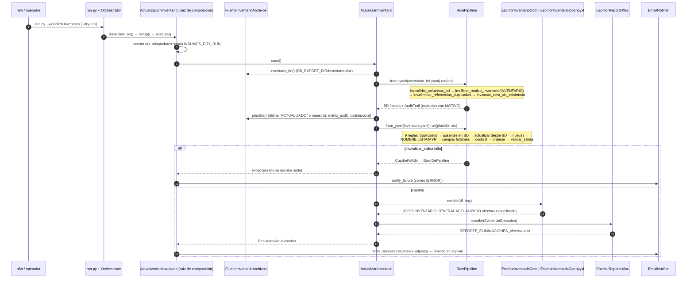
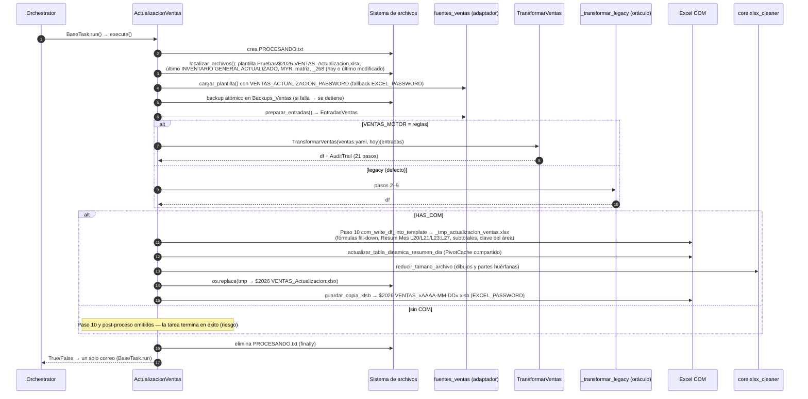

# 03 · Flujos de datos

> Fuente: hiperaristas `he_composicion_inventario`, `he_motor_dual_paridad`, `he_paso10_postproceso` y comunidades «Composición de inventario», «Ejecución y post-proceso de ventas», «Paso 10 COM de ventas», «Motor dual (VENTAS_MOTOR)», «WhatsApp Web (Selenium)» y «Capturas del informe» de `graphify-out/graph.json`.
> Rutas expresadas relativas a `BASE_PATH` / `DB_EXPORT_DIR` (nunca rutas absolutas de usuario).

## 1. Inventario General (`actualizacion_inv`) — migrado

> **Diagrama interactivo** (Archify, verificado contra `088f6f0`): [abrir en el índice](diagramas/main.html#04_inventario) · [abrir aparte](diagramas/03_flujo-inventario.html). El bloque Mermaid de abajo es la versión resumida para leer en GitHub/VS Code.



| Etapa | Entrada | Transformación / validación | Salida | Evidencia |
|---|---|---|---|---|
| Composición | `Settings`, `INSUMOS_DRY_RUN` | Selecciona escritor COM (producción) u openpyxl (`dry-run/`) | `ActualizarInventario` | `tasks/actualizacion_inventario.py:L63` · `tasks_actualizacion_inventario_actualizacioninventario_construir` |
| Lectura BD | `Inventario.xlsx` | Encabezados normalizados | DataFrame BD | `src/insumos/adapters/excel/fuentes_inventario.py` · `src_insumos_adapters_excel_fuentes_inventario_leer_inventario_bd` |
| Pipeline BD | DataFrame BD | 4 reglas (`config/rules/inventario_bd.yaml`) | BD filtrada + motivos de exclusión | `config_rules_inventario_bd` |
| Plantilla | Última salida `ACTUALIZADO` o maestro | `ruta_plantilla()` vía `archivos.mas_reciente` | `PlantillaInventario` | `src/insumos/adapters/excel/fuentes_inventario.py:L94` · `src_insumos_adapters_excel_fuentes_inventario_fuenteinventarioarchivos` |
| Pipeline plantilla | Plantilla + ctx | 9 reglas (`config/rules/inventario.yaml`); `inv.validar_salida` bloquea | df final | `config_rules_inventario`; `src_insumos_domain_rules_inventario_actualizacion_validarsalida` |
| Escritura | df final | 10 pasos COM: descifrar, mapear encabezados, retitular `EXISTENCIA <MES DD>`, escribir por bloques, fórmulas Dif, subtotales, tablas dinámicas, `INVENTARIO COPIA`, guardar y cifrar | Libro cifrado | `src/insumos/adapters/excel/com_inventario.py:L231` · `src_insumos_adapters_excel_com_inventario_escritorinventariocom_escribir` |
| Evidencia | Auditorías + fuentes | Hojas por paso con nombres únicos ≤ 31 car. | Reporte de eliminaciones | `src/insumos/adapters/excel/reporte_inventario.py:L128` · `src_insumos_adapters_excel_reporte_inventario_escritorreportexlsx`; `src_insumos_adapters_excel_reporte_inventario_nombres_de_hoja` |
| Notificación | Resultado | Resumen + aviso si la BD no es de hoy | Correo con adjunto | `tasks/actualizacion_inventario.py:L122` · `tasks_actualizacion_inventario_actualizacioninventario_notify_success` |

## 2. Ventas (`actualizacion_ventas`) — motor dual

> **Diagrama interactivo** (Archify, verificado contra `088f6f0`): [abrir en el índice](diagramas/main.html#05_ventas) · [abrir aparte](diagramas/03_flujo-ventas.html). El bloque Mermaid de abajo es la versión resumida para leer en GitHub/VS Code.



| Etapa | Entrada | Transformación / validación | Salida | Evidencia |
|---|---|---|---|---|
| Indicador | — | `PROCESANDO.txt` en `BASE_PATH` mientras corre | archivo indicador | `tasks/actualizacion_ventas.py:L322` · `tasks_actualizacion_ventas_actualizacionventas_crear_indicador_progreso` |
| Localización | Carpetas `BASE_PATH`, `DB_EXPORT_DIR` | `_268` de hoy o último modificado; inventario actualizado más reciente | 5 rutas | `tasks/actualizacion_ventas.py:L2176` · `tasks_actualizacion_ventas_actualizacionventas_localizar_archivos`; L399 `..._find_informe_facturas_by_prefix`; L500 `..._find_inventario_actualizado` |
| Plantilla | Libro del área | Descifra con clave del área; transición desde la clave anterior | stream + columnas | `tasks/actualizacion_ventas.py:L202` · `tasks_actualizacion_ventas_actualizacionventas_abrir_actualizacion` |
| Respaldo | Plantilla | Copia a temporal + `os.replace`; falla → `RuntimeError` | `Backups_Ventas/$2026 VENTAS_Actualizacion.xlsx` | `tasks/actualizacion_ventas.py:L2553` · `tasks_actualizacion_ventas_actualizacionventas_ejecutar` |
| Entradas | Informe, inventario, MYR (.xlsb con `pyxlsb`), matriz, licitados | Normalización de encabezados; licitados en formato largo con precio > 0 | `EntradasVentas` | `tasks/actualizacion_ventas.py:L2218` · `tasks_actualizacion_ventas_actualizacionventas_preparar_entradas`; `src_insumos_adapters_excel_fuentes_ventas_leer_precios_licitados` |
| Transformación | `EntradasVentas` | Motor según `VENTAS_MOTOR` | df alineado a la plantilla | `tasks/actualizacion_ventas.py:L2260` · `tasks_actualizacion_ventas_actualizacionventas_transformar` |
| Paso 10 | df + plantilla | Escritura COM vectorizada, fórmulas, periodo del mes y festivos, subtotales, contraseña del área | `_tmp_actualizacion_ventas.xlsx` | `tasks/actualizacion_ventas.py:L1286` · `tasks_actualizacion_ventas_actualizacionventas_com_write_df_into_template`; L1164 `..._actualizar_periodo_mes`; L1204 `..._calcular_y_escribir_subtotales` |
| Post-proceso | Temporal | Tablas dinámicas → reducción de tamaño → reemplazo atómico → `.xlsb` | Libro final + copia | Hiperarista `he_paso10_postproceso` |

## 3. Envío del informe (`envio_informe_ventas`) — legacy

> **Diagrama interactivo** (Archify, verificado contra `088f6f0`): [abrir en el índice](diagramas/main.html#06_envio) · [abrir aparte](diagramas/03_flujo-envio.html). El bloque Mermaid de abajo es la versión resumida para leer en GitHub/VS Code.

```mermaid
sequenceDiagram
    autonumber
    participant R as Orchestrator
    participant E as EnvioInformeVentas
    participant X as Excel COM (visible)
    participant CB as Portapapeles (win32clipboard/PIL)
    participant CD as chromedriver_utils
    participant W as WhatsAppWeb (Selenium)
    participant M as EmailNotifier
    R->>E: BaseTask.run() → setup() (destinatarios WHATSAPP_CHATS)
    E->>X: abre $2026 VENTAS_Actualizacion.xlsx (clave del área)
    loop 4 capturas (CAPTURAS)
        E->>X: filtra pivote al mes / oculta días previos / resuelve hoja
        X->>CB: CopyPicture del rango
        CB-->>E: PNG en Img informe/
    end
    E->>X: extraer_factor_mg_neto
    E->>X: cierra solo su instancia (PID)
    E->>CD: obtener_chromedriver_path (compatible con Chrome)
    E->>W: iniciar_sesion() (perfil persistente, hasta 3 intentos; si fallan, revalida chromedriver y 3 más)
    loop por destinatario
        W->>W: buscar_chat → enviar_texto("Cordial saludo... VTAS «MES» MG NETO PONDERADO «factor»")
        W->>W: enviar_imagen × 4 (Ctrl+V)
    end
    alt exitosos == 0
        E-->>R: RuntimeError → correo [ERROR]
    else ≥ 1
        E->>M: notify_success (resumen + log)
    end
    E->>W: teardown → cerrar() (solo Chrome del perfil)
```

| Etapa | Entrada | Validación | Salida | Evidencia |
|---|---|---|---|---|
| Capturas | Libro de ventas | Omite captura si no existe la hoja; ≥ 1 imagen válida | `foto1..foto4 *.png` | `tasks/envio_informe_ventas.py:L1427` · `tasks_envio_informe_ventas_capturar_multiples_rangos` |
| Factor | Hoja de resumen | — | "MG NETO PONDERADO" | `tasks/envio_informe_ventas.py:L1234` · `tasks_envio_informe_ventas_extraer_factor_mg_neto` |
| Sesión | Perfil Chrome en estado operativo | Reintento tras revalidar ChromeDriver | sesión WhatsApp | `tasks/envio_informe_ventas.py:L442` · `tasks_envio_informe_ventas_whatsappweb_iniciar_sesion` |
| Envío | Chats | `exitosos == 0` → fallo | mensajes | `tasks/envio_informe_ventas.py:L957` · `tasks_envio_informe_ventas_whatsappweb_enviar_reporte_completo` |
| Cierre | PIDs | Solo Chrome del `user-data-dir` y Excel propio | — | `tasks/envio_informe_ventas.py:L277` · `tasks_envio_informe_ventas_cerrar_chrome_del_perfil`; L1416 `tasks_envio_informe_ventas_pid_de_excel` |

Capturas configuradas (`tasks/envio_informe_ventas.py:L118`): `Resumen Dia` (VTA DIA, dinámica), `Resum Mes` (RESUMEN MES), `Resumen Meta 2026` (A1:R14), `Resumen XDiaVend INF` (RESUMEN DIA POR VENDEDOR, día actual).
