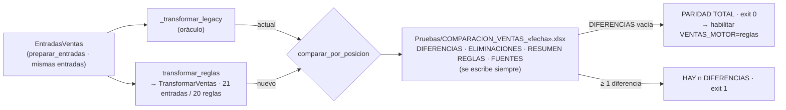

# 04 · Motor de reglas de ventas

> Fuente: comunidades «Motor dual (VENTAS_MOTOR)», «Reglas YAML de ventas» y «Paridad de ventas», hiperarista `he_motor_dual_paridad`, nodos `config_rules_ventas_ven_*` (orden del YAML) y nodos de clase `src_insumos_domain_rules_ventas_*` enlazados por `references` (`registry_id`). Las 21 entradas se enlazan a `TransformarVentas` con aristas `uses` (EXTRACTED).

## 1. Mecánica

1. `TransformarVentas.__call__` arma `RuleContext(tablas={inventario, myr, matriz_clientes[, precios_licitados]}, hoy, params={columnas_plantilla, nits_licitados})` (`src/insumos/application/transformar_ventas.py:L46` · `src_insumos_application_transformar_ventas_transformarventas_call`).
2. `RulePipeline.from_yaml("config/rules/ventas.yaml")` valida el YAML (`leer_declaracion`) y resuelve cada `id` contra el registro (`construir`, que rechaza parámetros desconocidos) (`src/insumos/domain/pipeline.py:L119`).
3. `run()` aplica las reglas en orden; una excepción detiene el pipeline (`ErrorDePipeline`); cada paso queda en `AuditTrail` con filas antes/después, eliminadas, modificadas, advertencias y `ms` (`src/insumos/domain/pipeline.py:L57`).
4. El caso de uso **no escribe**: el Paso 10 (COM) sigue en el legacy.

`pipeline: ventas` · `version: 2026.10.2` · **21 entradas, 20 reglas distintas** (`ven.ordenar_por_fecha` se ejecuta en las posiciones 12 y 20).

## 2. Catálogo

Clases en `src/insumos/domain/rules/ventas/` (`informe.py`, `integraciones.py`, `salida.py`). "Elimina" = filas a `AuditTrail.eliminaciones` con `_motivo`/`_regla`.

| Orden | id | Propósito (description) | Entradas | Salidas / efecto | Clase · línea |
|---|---|---|---|---|---|
| 1 | `ven.detectar_encabezado_informe` | Ubica la fila de encabezados (hasta 15 filas de título) | Informe crudo | Encabezado en fila 1; métrica `fila_encabezado` | `DetectarEncabezadoInforme` · `informe.py:L34` |
| 2 | `ven.excluir_prefijos` | Excluye notas crédito/débito por descuento | `Prefijo`; params `prefijos: [NC, NCDTO, NDCTO]` | Elimina | `ExcluirPrefijos` · `informe.py:L57` |
| 3 | `ven.estructurar_informe` | Prepara `VR DESCUENTO` y `Valor unitario` | Columna "valor descuento comercial", `Valor bruto` | Renombra/inserta columnas | `EstructurarInforme` · `informe.py:L74` |
| 4 | `ven.fecha_de_venta` | FE originada en PV toma `Fecha documento origen`; si no, `Fecha` | `Prefijo`, `Documento origen`, fechas | Fecha única; métricas por origen; advierte nulas | `FechaDeVenta` · `informe.py:L102` |
| 5 | `ven.calcular_valor_unitario` | `Valor bruto / Cantidad facturada`; reubica columnas | `Valor bruto`, `Cantidad facturada` | `Valor unitario` | `CalcularValorUnitario` · `informe.py:L144` |
| 6 | `ven.eliminar_sin_referencia` | Elimina líneas sin `Referencia` | `Referencia` | Elimina | `EliminarSinReferencia` · `informe.py:L171` |
| 7 | `ven.tipificar_informe` | Tipos, costo unitario positivo, `FECHA`, encabezados en mayúsculas; **referencia como texto** | Informe | Encabezados normalizados | `TipificarInforme` · `informe.py:L188` |
| 8 | `ven.excluir_referencias_no_comerciales` | Excluye `FLETE VENTAS` y las que contienen `PUBLICIDAD` | `REFERENCIA`; params `exactas`, `contienen` | Elimina | `ExcluirReferenciasNoComerciales` · `informe.py:L214` |
| 9 | `ven.filtrar_anio_en_curso` | Solo año en curso (hora Colombia) | `FECHA`, `ctx.hoy` | Elimina; lanza `InformeSinDatos` si queda vacío | `FiltrarAnioEnCurso` · `informe.py:L238` |
| 10 | `ven.calcular_periodo` | `ANO`, `MES NO.`, `MES` | `FECHA` | Columnas de periodo | `CalcularPeriodo` · `informe.py:L263` |
| 11 | `ven.mapeo_semantico` | Renombra a nombres de la plantilla (`MAPEO_SEMANTICO`) | Encabezados del informe | p. ej. `NRO. DOCUMENTO CLIENTE → NIT CLIENTE`, `VALOR BRUTO → VR TOTAL` | `MapeoSemantico` · `informe.py:L280` |
| 12 | `ven.ordenar_por_fecha` | `FECHA` descendente y `FECHA DE ACTUALIZACION = hoy` | `FECHA` | Orden | `OrdenarPorFecha` · `informe.py:L292` |
| 13 | `ven.integrar_linea_sublinea` | `LINEA`/`SUBLINEA`/`LIDER LINEA` del inventario actualizado por `REFERENCIA` | `ctx.tablas["inventario"]` (obligatoria) | Columnas; advierte ventas sin LINEA | `IntegrarLineaSublinea` · `integraciones.py:L37` |
| 14 | `ven.integrar_costo_factor_hoy` | `COSTO FACTOR HOY` del MYR por `REFERENCIA` | `ctx.tablas["myr"]` | Columna; advierte si falta MYR | `IntegrarCostoFactorHoy` · `integraciones.py:L82` |
| 15 | `ven.integrar_dcto_condicionado` | `DCTO CONDICIONADO` por NIT (solo `TIPO DESCUENTO = CONDICIONADO`); `"12,5%" = 0.125` | `ctx.tablas["matriz_clientes"]` | Columna (0 si no aplica) | `IntegrarDctoCondicionado` · `integraciones.py:L155` |
| 16 | `ven.eliminar_referencias_invalidas` | Sin `LINEA` y referencia que no es código (> 30 car. o > 3 palabras) | `LINEA`, `REFERENCIA` | Elimina | `EliminarReferenciasInvalidas` · `integraciones.py:L193` |
| 17 | `ven.normalizar_dctos` | `DCTO CONDICIONADO = "0%"` cuando ya hay `VR DESCUENTO` | Descuentos | Modifica | `NormalizarDctos` · `integraciones.py:L221` |
| 18 | `ven.vta_acordada_licitado` | `VTA ACORDADA X UNIDAD LICITADO` por (REFERENCIA, NIT licitado) | `ctx.tablas["precios_licitados"]`, `params.nits_licitados` | Columna (0 si no licitado); advierte si falta la hoja | `VtaAcordadaLicitado` · `integraciones.py:L247` |
| 19 | `ven.alinear_con_plantilla` | Orden de columnas de la plantilla; omite columnas de fórmula | `params.columnas_plantilla` (obligatorio) | Columnas finales | `AlinearConPlantilla` · `salida.py:L21` |
| 20 | `ven.ordenar_por_fecha` | (segunda ejecución) | — | — | `OrdenarPorFecha` · `informe.py:L292` |
| 21 | `ven.validar_salida` | Columnas clave, filas > 0 y todas las fechas del año en curso | `REFERENCIA`, `NIT CLIENTE`, `FECHA` | Lanza `SalidaVentasInvalida`; métrica `por_mes` | `ValidarSalida` · `salida.py:L49` |

Correspondencia con los pasos del legacy (comentarios del YAML): 1–11 = Paso 2, 12 = Paso 3, 13–18 = Pasos 4–7.5, 19–21 = Pasos 8–9.

**Observación del grafo**: la regla 18 depende de que el adaptador entregue la hoja `PRECIO UNIT LICITADOS` ya en formato largo y filtrada a precio > 0 (`src/insumos/adapters/excel/fuentes_ventas.py:L100` · `src_insumos_adapters_excel_fuentes_ventas_leer_precios_licitados`); en el legacy esa lógica está duplicada dentro de `_transformar_legacy` (L2432–L2518). Hasta retirar el legacy, todo cambio en licitados se mantiene en **dos lugares**.

## 3. Mecanismo de paridad

> **Diagrama interactivo** (Archify, verificado contra `088f6f0`): [abrir en el índice](diagramas/main.html#07_paridad) · [abrir aparte](diagramas/04_motor-paridad.html). El bloque Mermaid de abajo es la versión resumida para leer en GitHub/VS Code.

| Pieza | Qué hace | Evidencia |
|---|---|---|
| Paridad sintética | Datos con todas las ramas, filas de título, ajustes de negocio, ausencia de licitados | `tests/unit/rules/test_paridad_ventas.py` · `tests_unit_rules_test_paridad_ventas` (11 pruebas) |
| Paridad real | Lee los **mismos** archivos de producción, corre ambos motores, no escribe plantilla, no hace backup, no envía correos | `scripts/comparar_ventas.py:L38` · `scripts_comparar_ventas_main` |
| Comparador | Diferencias fila a fila en el mismo orden | `src/insumos/adapters/excel/comparador.py:L264` · `src_insumos_adapters_excel_comparador_comparar_por_posicion` |
| Código de salida | `0` = paridad total; `1` = diferencias | `scripts/comparar_ventas.py` (docstring y `return`) |
| Selector | `VENTAS_MOTOR` ∈ {`legacy` (defecto), `reglas`}; valor inválido → `legacy` | `tasks/actualizacion_ventas.py:L2171` · `tasks_actualizacion_ventas_actualizacionventas_motor`; `env_ventas_motor` |

**Limitación estructural** (aristas del legacy hacia `insumos.domain` en `graph.json`; ver `tasks_actualizacion_ventas_acoplamiento_dominio`): el oráculo y el motor nuevo comparten `normalizar_referencia`, `texto_licitado` y `descuento_a_decimal`. La paridad prueba la **equivalencia del orquestado**, no la corrección de esas tres funciones; su corrección depende de pruebas unitarias con casos aprobados por negocio (`test_normalizar_referencia_es_texto`, `test_texto_licitado`, `test_descuento_a_decimal`).

## 4. Criterio de corte legacy → reglas

Criterio documentado (nodo `scripts_comparar_ventas_criterio_corte`, ADR 0009 §Decisión 4; README "Pendiente" 1):

| Paso | Condición de salida medible | Responsable |
|---|---|---|
| 1. Paridad real | `uv run python scripts/comparar_ventas.py` devuelve **exit 0** con datos reales del día | Área de Datos |
| 2. Activación | `VENTAS_MOTOR=reglas` en el `.env` de producción | Área de Datos + Control de Ventas (gobierno del YAML: `config/rules/ventas.yaml`, encabezado) |
| 3. Observación | **2 semanas** de corridas sin diferencias (comparación diaria) | Área de Datos |
| 4. Retiro | Borrar `_transformar_legacy` y su duplicación de licitados; Fase 4b | Área de Datos |

Recomendación (análisis, no decisión aprobada): mientras dure el periodo de observación, ejecutar `comparar_ventas.py` **después** de cada corrida productiva y conservar el `COMPARACION_VENTAS_*.xlsx` como evidencia de cierre; durante el motor dual, todo cambio de negocio se aplica en ambos motores (README §Ventas).
